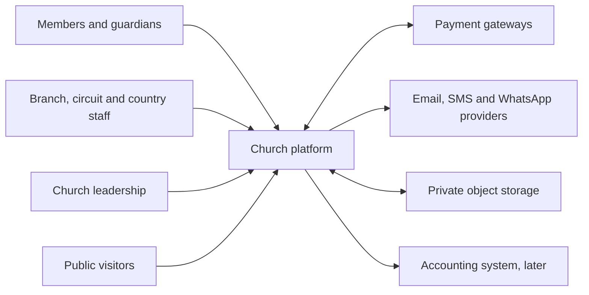
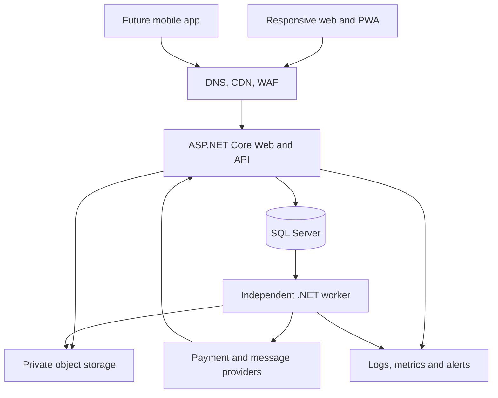
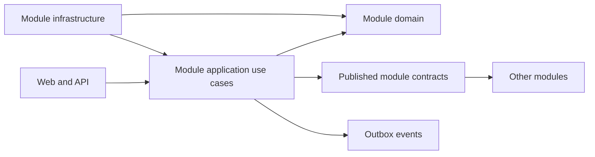
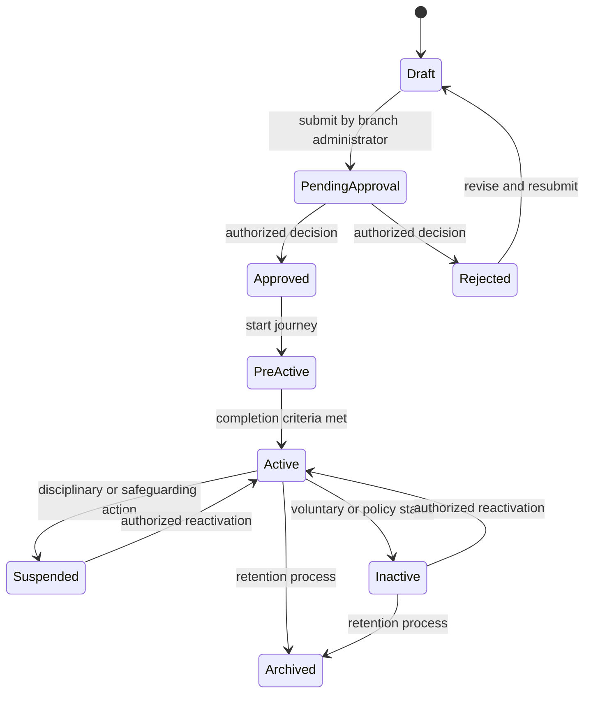
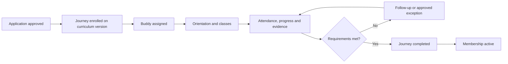
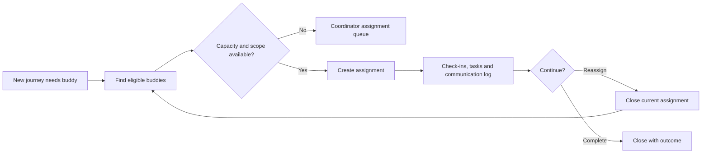
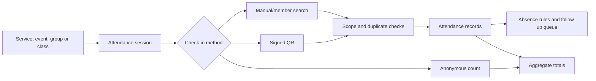
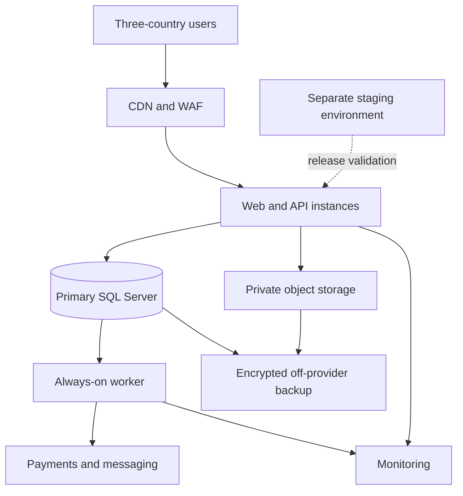

# Church Management and Digital Ministry Platform — System Architecture Blueprint

This transferred planning blueprint reflects your stated long-term operating model: one denomination, four stated countries (South Africa, Eswatini/Swaziland, Mozambique and Zimbabwe), approximately 25 circuits and 175 branches, web first, later mobile, member self-service, manual and online giving, intermittent connectivity, and SMS/email/WhatsApp communication. **South Africa is the only current build/pilot scope; Mozambique is next**, while Eswatini/Swaziland and Zimbabwe are unscheduled. Design the core for later country expansion without implementing their providers or policies now.

It is a **target architecture**, not a claim that the new solution already implements these capabilities. The previous application's code is not being migrated into this repository. See the [new solution structure](new-solution-structure.md) for what exists now.

Three decision groups remain open: each country's regulatory/payment requirements and remaining rollout timing; peak/concurrent member and transaction volumes; and whether household members may see combined giving. None prevents synthetic foundation work, but each affects later design.

## 1. Executive Technical Summary

Build a **modular monolith** in ASP.NET Core with one SQL Server operational database, an independent background worker, private object storage, and versioned APIs. Keep one denomination as the initial operating model, but include `ChurchId` on church-owned records from day one so future commercialization does not require a database rewrite.

The first production release should concentrate on organization structure, scoped authorization, member registration and approval, member identity, auditability, and secure deployment. Member portal and giving should follow early because they are explicit business needs. Store, advanced engagement analytics, and broad integrations should come later.

At this size, microservices, regional databases, a data warehouse, and Kubernetes are unnecessary.

## 2. Architectural Principles

1. Security and privacy by default; deny access unless explicitly granted.
2. Permissions are scoped to organizational units and, where needed, individual records.
3. Business workflows have explicit states and transitions.
4. Financial and audit records are append-only after finalization.
5. Modules own their data and expose contracts; no direct cross-module writes.
6. Operations and integrations are idempotent because retries are inevitable.
7. Sensitive data is collected only for a defined purpose.
8. Prefer simple, operable infrastructure over premature distribution.
9. Preserve an upgrade path for mobile, additional countries, and future SaaS.
10. Make changes observable, testable, and reversible.

## 3. Recommended Architecture Style

Use a **modular monolith with vertical slices inside each module**:

- **Domain:** aggregates, value objects, invariants, state transitions, domain events.
- **Application:** commands, queries, validators, authorization checks, transactions.
- **Infrastructure:** EF Core persistence, file storage, payment and messaging adapters.
- **Web/API:** Razor/MVC pages, REST endpoints, authentication, request mapping.
- **Shared kernel:** only truly shared primitives such as `ChurchId`, `OrgUnitId`, `Money`, `Result`, and audit metadata.

Do not build one giant generic `Application` project containing every feature. Each module should contain its own domain, application, infrastructure, and endpoint folders. Use dependency rules and architecture tests to prevent accidental coupling.

Microsoft lists .NET 10 as LTS through November 2028. The current repository now targets .NET 10; that dependency upgrade does not implement the modular architecture or replace the need for baseline behavior tests. [Microsoft .NET support policy](https://learn.microsoft.com/en-us/dotnet/core/releases-and-support) See the [upgrade record](../operations/dependency-upgrade-2026-09-16.md).

## 4. System Context Diagram



## 5. Container/Application Diagram



The provider-to-web connection is for verified webhooks. Browsers never assert that a payment succeeded.

## 6. Module Map

| Module | Owns |
|---|---|
| Organization | Denomination, countries, circuits, branches, configuration, leadership assignments |
| Identity & Access | Accounts, branch-captured registration requests, role assignments, permissions, scope, devices |
| Membership | Person/member profile, status, family links, transfer, history, change requests |
| New Member Journey | Curriculum versions, enrolment, milestones, progress, completion |
| Buddy | Eligibility, capacity, assignments, check-ins, tasks, reassignment |
| iMihlangano | Groups, schedules, allocation, group history and health |
| Attendance | Sessions, check-ins, counts, absence signals |
| Ministries & Volunteers | Ministry membership, opportunities, requirements, rosters |
| Events | Events, sessions, registration, capacity, tickets |
| Pastoral Care & Prayer | Restricted cases, confidential notes, prayer visibility |
| Communications | Templates, targeting, consent, deliveries |
| Store | Catalogue, inventory, cart, orders, fulfilment, returns |
| Giving & Payments | Funds, manual giving, online attempts, receipts, adjustments |
| Documents | Metadata, ownership, classification, access |
| Approvals | Reusable approval coordination and decisions |
| Reporting | Operational read models and executive aggregates |
| Audit & Platform | Audit, outbox, jobs, configuration and observability |

## 7. Module Dependency Rules



Rules:

- A module may read another module only through a published query contract or a deliberately owned read model.
- A module never updates another module’s tables.
- Cross-module references use stable IDs, not shared mutable EF navigation graphs.
- Domain events inside one database transaction are in-process. Notifications and integrations use a transactional outbox.
- No dependency from `Domain` to ASP.NET, EF Core, or provider SDKs.
- No generic repository abstraction around EF Core unless a particular aggregate needs one.

## 8. Domain Model

The principal aggregates are:

- `OrganizationalUnit`: hierarchy and branch configuration.
- `Member`: identity of the church member, status, primary branch, protected profile rules.
- `MembershipApplication`: registration and approval decisions; distinct from identity login.
- `MemberJourney`: an enrolment against an immutable curriculum version.
- `BuddyAssignment`: mentor relationship, dates, workload, check-ins.
- `CellGroup`: group identity, schedule, capacity, membership.
- `AttendanceSession`: one gathering; owns check-ins and aggregate counts.
- `Event`: schedule, capacity and registration policy.
- `PastoralCase`: security boundary for confidential care.
- `Product` and `Order`: catalogue and sale lifecycle.
- `ContributionBatch` and `Contribution`: manual/online giving.
- `ApprovalRequest`: reusable decision coordination, not a substitute for domain state.
- `Document`: metadata and access classification.

The existing `Member` table should not accumulate family, education, skills, notes, documents, journey, and payment fields.

## 9. Core Entity Catalogue

| Entity | Key relations and properties | Primary invariant |
|---|---|---|
| `Church` | `Id`, name, `status` | One initial denomination |
| `OrganizationalUnit` | `Id`, `ChurchId`, `ParentId`, type, country, timezone, currency | Valid hierarchy; no cycles |
| `Member` | `Id`, `ChurchId`, primary `BranchId`, status, person reference | Cannot be active without approval |
| `MembershipApplication` | `Id`, `MemberId`, branch, submitter, status | One open application per member |
| `MemberBranchHistory` | member, from/to branch, effective dates | Non-overlapping primary assignments |
| `MemberJourney` | member, curriculum version, status | One active journey of a given type |
| `BuddyAssignment` | journey, buddy, dates, status | Capacity and eligibility respected |
| `CellGroupMembership` | group, member, dates, status | Allocation history retained |
| `AttendanceSession` | context type/id, branch, starts/ends | Check-ins belong to one session |
| `EventRegistration` | event, attendee, status, ticket | Capacity policy enforced |
| `PastoralCase` | subject, owner team, classification, status | Access requires case-specific grant |
| `Contribution` | member/donor, branch, fund, money, source, status | Posted record cannot be edited |
| `Order` | purchaser, lines, payment/fulfilment status | Totals reflect immutable order snapshot |
| `Document` | owner type/id, classification, object key | Download requires owner-aware authorization |

All mutable aggregates should have `CreatedAtUtc`, `CreatedBy`, `UpdatedAtUtc`, `UpdatedBy`, and `RowVersion`. Do not add `IsActive` mechanically when a richer status and effective-date model exists.

## 10. Database Design

Use one SQL Server database initially, with **module-owned schemas** such as `org`, `membership`, `journey`, `attendance`, `finance`, `store`, `audit`. This is logical separation, not a separate database per module.

Conventions:

- `uniqueidentifier` or appropriately generated 64-bit IDs; choose one consistently. UUIDs are especially useful for offline-created operations. Use sequential UUID generation where supported to reduce index fragmentation.
- `datetimeoffset` or UTC timestamps for events; retain `TimeZoneId` for local display and scheduling.
- `decimal(19,4)` plus ISO currency code for money. Never use floating point.
- `RowVersion` for optimistic concurrency.
- Explicit foreign keys within a module; stable logical IDs and contracts across modules.
- Unique indexes for business invariants, e.g. `(ChurchId, ExternalPaymentId)` and `(DeviceId, ClientOperationId)`.
- Index common filters on `(ChurchId, BranchId, Status, CreatedAtUtc)` as workload evidence supports.
- Use lookup tables for church-configurable values; use code enums only for stable technical states.
- Soft-delete ordinary drafts/reference records where recovery matters. Do not soft-delete financial or audit facts; use status, reversal, and retention rules.
- Use SQL temporal tables selectively for member profile and authorization history, not as a replacement for purposeful audit records.

Include `ChurchId` from day one even though only one denomination exists. It provides future SaaS separation and makes ownership explicit, but **does not by itself authorize access**. EF global filters can reduce accidental cross-church reads; Microsoft documents both their utility and limitations, so every sensitive query and mutation still needs explicit scope authorization and tests. [EF Core global query filters](https://learn.microsoft.com/en-us/ef/core/querying/filters)

## 11. Identity and Authorization Architecture

Use ASP.NET Core Identity initially, with a custom `ApplicationUser`. Keep user accounts separate from members and link them through `MemberUserLink`. Do not allow public registration to create a `Member`.

Model:

```text
User
Role
Permission
RolePermission
UserRoleAssignment(UserId, RoleId, OrgUnitId, ValidFrom, ValidTo)
RecordAccessGrant(UserId or TeamId, ResourceType, ResourceId, Permission, Expiry)
MemberUserLink(UserId, MemberId, VerifiedAt)
```

Authorization decision:

```text
authenticated
AND account active
AND permission granted
AND target ChurchId matches
AND target organizational unit is in assigned scope
AND record-specific restriction permits access
```

A national administrator can inherit country descendants; a branch administrator cannot see a sibling branch. Member self-service is authorized through the server-resolved `MemberUserLink`, never a caller-supplied `MemberId`. Pastoral cases and minor records require additional record-level checks. Use resource-based authorization for such decisions; ASP.NET Core supports authorizing a loaded resource against a policy. [Microsoft resource-based authorization](https://learn.microsoft.com/en-us/aspnet/core/security/authorization/resource-based?view=aspnetcore-10.0)

Roles are configurable bundles of permissions. Code depends on permission constants such as `Member.Approve`, not on names such as “Amalunga”.

## 12. Membership Approval Workflow

Maintain two related states:

- **Registration status:** `Draft → PendingApproval → Approved` or `Rejected`.
- **Membership status:** `PreActive → Active → Suspended / Inactive → Archived`.

Approval acknowledges the person as accepted into the formal process. Completion of required journey criteria transitions them to active membership. Leadership may configure an exception with a recorded reason.



The transition service must check actor permission, branch scope, current state, mandatory fields, duplicate checks, and approval policy. Every transition produces a domain event and audit record. Rejecting a person must never erase the application history.

## 13. New Member Journey Architecture

Version curriculum definitions. Editing a curriculum must not silently change the requirements for people already enrolled.

```text
Curriculum → CurriculumVersion → Module → Lesson
                                  → Requirement → Milestone
MemberJourney → StepProgress → CompletionEvidence
```

Requirements can be attendance, lesson completion, assessment, baptism/confirmation where applicable, ministry introduction, iMihlangano allocation, or manual leadership sign-off. A rules evaluator calculates completion from a published curriculum version; authorized leaders can grant documented exceptions.



## 14. Buddy System Architecture

`BuddyAssignment` is a time-bounded relationship, not a `BuddyId` field on `Member`. `BuddyProfile` tracks eligibility, training, availability, preferred language, branch restrictions, and maximum concurrent journeys. Assignment history remains after reassignment.



Buddy performance reporting should focus on workload, timely follow-up, and journey completion—not a simplistic ranking of people. Confidential pastoral content must not be exposed to buddies by default.

## 15. iMihlangano Architecture

Use `CellGroup`, `CellGroupSchedule`, `CellGroupLeaderAssignment`, `CellGroupMembership`, `CellGroupMeeting`, and `CellGroupAnnouncement`. Tuesday/Thursday are seed configuration, not schema columns. Schedule supports recurrence, exceptions, local time zone, venue, online link, language, capacity, and life-stage criteria.

Allocation is a dated membership relationship, preserving transfers. Member search should rank branch, distance where location consent exists, schedule fit, language, life stage, and capacity. GPS is optional; do not publish private home addresses without permission.

Health indicators should be transparent aggregates—attendance trend, capacity, new allocations, follow-up backlog—not opaque judgments about leaders.

## 16. Attendance Architecture

Use **one generalized attendance engine** with `AttendanceSession(ContextType, ContextId, BranchId, StartsAtUtc)` and `AttendanceRecord(SessionId, MemberId?, CheckInMethod, RecordedBy)`. Specialized modules own their context and policies:

- Events own registration and ticket validity.
- Journey owns class requirements.
- iMihlangano owns group membership.
- Attendance owns the act of presence.

Allow anonymous counts separately from identified check-ins. Unique `(SessionId, MemberId)` prevents duplicates. QR codes should carry short-lived signed session/check-in tokens, not personal information.



## 17. Event Architecture

Separate `EventRegistration` from `AttendanceRecord`. An event may have capacity, venue, multiple sessions, registration windows, waitlist, ticket categories, optional price, and cancellation rules. A registered person may never attend; an attendee may be admitted without preregistration where policy permits.

Paid events use the shared payment module but produce an event-order/payment reference, not a charitable contribution. Refund policies are event-specific and require auditable transitions.

## 18. Ministry and Volunteer Architecture

`MinistryDefinition` describes the church-wide ministry; `BranchMinistry` represents its local presence. `MinistryMembership` tracks members, roles, and effective dates.

For volunteers, model `Opportunity → Shift → RosterAssignment`. A shift has required roles, capacity, skills/training prerequisites, time, venue, and replacement policy. Assignments have `Invited`, `Accepted`, `Declined`, `Cancelled`, `Completed`, and `NoShow` states. A substitution closes the old assignment and creates a linked replacement; it does not overwrite history.

## 19. Pastoral Care Security Architecture

Pastoral data deserves a separate security boundary inside the monolith:

- Separate `pastoral` schema and module-specific data access.
- Case-level grants to named care teams or practitioners.
- Confidentiality classifications; “highly restricted” cases may require explicit invitation even for senior administrators.
- Field encryption for especially sensitive notes where operationally feasible, with separate key management.
- Access logging for every case and document read.
- “Break glass” access only for designated personnel, with reason, expiry, and immediate alert.
- No pastoral note text in search indexes, ordinary audit diffs, analytics, or notification payloads.
- Executive dashboards show minimum-threshold aggregate counts only.

A branch administrator does not gain pastoral access merely because the case subject belongs to that branch.

## 20. Communication Architecture

The communications module owns templates, audiences, preferences, consent, campaigns, deliveries, and provider outcomes. Define adapters such as `IEmailSender`, `ISmsSender`, and `IWhatsAppSender`; business modules publish notification intents, not vendor API calls.

Audience selection is evaluated at send time against current scope and communication preferences. Store the audience query definition and a delivery snapshot for audit. Apply frequency caps and suppression lists. WhatsApp availability, template approval, and cost vary by provider and country, so make it optional per country and use approved templates for transactional communication.

## 21. Store Architecture

Begin with a small catalogue and branch stock:

```text
Category → Product → Variant
Variant → PriceListEntry
Variant + StockLocation → InventoryBalance
StockMovement → immutable quantity changes
Cart → Order → Payment → Fulfilment
```

Order lines snapshot description, SKU, price, tax treatment, and currency at checkout. Stock is adjusted through movements: receipt, sale, return, transfer, correction. Do not directly edit the balance without a movement. Introduce warehouses only when branch stock operations require them.

Reserve stock during checkout for a limited period; release on failed/expired payment. Keep store sales and charitable giving separate in accounting and reporting.

## 22. Giving and Finance Architecture

Manual and online giving converge on one `Contribution` model. Supporting records include `Fund`, `Campaign`, `ContributionBatch`, `PaymentAttempt`, `PaymentProviderEvent`, `Receipt`, `Adjustment`, and `ReconciliationItem`.

Rules:

- Manual entry may be captured offline but remains `PendingSync` locally and `Unposted` server-side until validated.
- Posted contributions are immutable; mistakes create reversals or adjustments.
- Online giving posts only after verified server-to-server payment confirmation.
- Webhook events are stored, signature-verified, deduplicated, and replayable.
- Reconcile provider settlement with internal payments.
- Store amount and ISO currency; never silently combine currencies.
- Anonymous contributions may omit member linkage but retain source and branch allocation.
- Separate donation receipts from purchase invoices.
- No mandatory second-person approval for ordinary posting, per your decision; exceptional refunds and adjustments can still have policy-based approval.

## 23. Document Management Architecture

Store metadata in SQL and binary content in private object storage. Metadata includes `ChurchId`, owner module/type/id, branch, classification, filename, content type, size, checksum, object key, uploaded by, retention rule, and consent/visibility flags.

Every download resolves ownership and authorization before returning a short-lived signed URL or streaming the file. Scan uploads, allowlist types, verify file signatures, limit size, and re-encode images. Public website media is explicitly published to a separate public delivery path. Never place member, minor, pastoral, or finance files in `wwwroot`.

## 24. Approval Engine

Choose a **hybrid**:

- Each domain module owns its state machine and invariants.
- A small reusable approval module owns request, approver assignment, decision, delegation, deadline, and audit.
- An approved decision calls the owning module’s transition command.

A universal workflow engine would be costly and obscure domain rules; wholly separate approval tables would duplicate mechanics. Start with one-step approval, configurable approver permission/scope, and optional escalation. Add multi-step definitions only when a real process needs them.

## 25. Audit Architecture

Use three related records:

1. **Business audit:** who changed an aggregate, before/after for permitted fields, reason, timestamp, correlation ID.
2. **Security log:** login, MFA, role changes, denied access, device events, break-glass use.
3. **Access log:** reads/downloads of pastoral cases, children’s records, confidential documents, and bulk exports.

Never log passwords, tokens, card data, medical note bodies, or full sensitive payloads. Audit records should be append-only, access-controlled, retained according to policy, and shipped to an off-platform log store. Financial changes also have domain transactions; generic audit logs alone are not an accounting history.

## 26. Notification and Background Processing Architecture

Use a transactional **outbox**: save the business change and an outbox message in the same SQL transaction. An independent worker leases messages, invokes providers, records attempts, retries with backoff, and moves exhausted items to a dead-letter state. Every handler is idempotent.

Start with a .NET Worker Service and SQL-backed outbox/job tables. A managed queue can be introduced when throughput or isolation requires it. Do **not** rely on an ASP.NET web process staying alive to deliver payments or reminders.

SmarterASP’s published shared-hosting scheduler is available on Premium and calls an HTTP GET URL at a normal minimum interval of 15 minutes. That is useful for coarse maintenance, but unsuitable as the sole timely worker for payment, messaging, and synchronization. [SmarterASP plans](https://www.smarterasp.net/hosting_plans), [scheduled-task documentation](https://www.smarterasp.net/support/kb/a2385/how-to-schedule-a-task.aspx)

## 27. API Architecture

Expose `/api/v1/...` endpoints alongside the web UI. Use resource-oriented REST, but model domain transitions explicitly as commands:

- `POST /api/v1/members/{id}/submit`
- `POST /api/v1/members/{id}/approve`
- `POST /api/v1/members/{id}/transfer-requests`
- `POST /api/v1/contribution-batches/{id}/post`

Standards:

- Cursor pagination for large feeds; bounded page size elsewhere.
- Allowlisted filtering and sorting.
- DTOs at the boundary; never bind EF entities directly.
- `ProblemDetails` errors with stable machine-readable codes and correlation IDs.
- `409 Conflict` for invalid transitions or concurrency conflicts.
- `ETag`/row version for edit concurrency where useful.
- `Idempotency-Key` for payments, orders, and offline submissions.
- OpenAPI documentation, but privileged schemas/endpoints need appropriate access.
- Cookies plus CSRF protection for first-party web; mobile authentication should use a standards-based token flow when the mobile app is introduced.

## 28. Integration Architecture

Define ports in application contracts and adapters in infrastructure:

- `IPaymentGateway`
- `IEmailProvider`
- `ISmsProvider`
- `IWhatsAppProvider`
- `IObjectStorage`
- `IAccountingExporter`
- `IGeocoder`
- `IIdentityProvider`, if federation is later needed

Each adapter translates provider-specific IDs and errors into platform concepts. Webhook receivers verify signatures and persist raw provider event metadata before domain processing. Provider outages must not roll back already committed church operations; retry asynchronous delivery where appropriate.

## 29. Reporting Architecture

Start with SQL-backed operational read models and indexed queries:

- Branch users see branch data.
- Circuit leaders see permitted descendant branches.
- Country leaders see country aggregates.
- Senior leadership sees denomination aggregates with sensitive details suppressed.

Use scheduled summary tables for expensive trends and asynchronous exports for large reports. Do not add a data warehouse initially. Revisit when query volume, historical depth, or cross-country analysis harms operational performance.

For engagement, define configurable `EngagementModelVersion`, weighted factors, observation windows, exclusions, and explanation records. Do not score giving amounts or confidential pastoral/prayer activity. Avoid automated adverse decisions based on a score; provide members transparency and correction mechanisms. Prefer aggregate pastoral counts over identifiable data.

## 30. Security Architecture

Baseline controls:

- MFA for privileged and finance users.
- Branch-led, in-person staff and member registration; no invitations or public self-registration.
- Secure password reset, lockout, session revocation, and device management.
- Default-deny authorization and scope checks on every query and command.
- TLS, secure cookies, HSTS, CSRF protection, output encoding, parameterized EF queries.
- Rate limits on login, search, exports, payments, webhooks, and synchronization.
- Secrets outside source control.
- Encryption at rest for database/backups and private storage.
- Explicit export permissions, watermarking where appropriate, and export audit.
- Upload scanning, content verification, and private storage.
- Dependency and secret scanning in CI.
- Regular access review and immediate deactivation workflow.

The existing repository contains a committed database credential and hard-coded administrator password. Rotate those credentials and remove both before any production migration.

## 31. POPIA Considerations

Religious affiliation, children’s information, and pastoral/health details require heightened treatment. Establish a lawful-purpose register, information officer ownership, retention schedule, privacy notices, consent records where applicable, data-subject request process, breach-response procedure, operator agreements, and cross-border transfer assessment. Avoid assuming consent is the only lawful basis; have qualified South African counsel review each processing purpose.

For minors, store guardian/competent-person relationships and consent evidence, restrict search and exports, separate photo permission from general participation, and minimize medical/emergency information. For a four-country rollout, perform a country-by-country privacy review; POPIA is only one jurisdiction. The Act specifically addresses special personal information, children’s information, security compromises, and cross-border transfers. [South African Government POPIA page](https://www.gov.za/documents/protection-personal-information-act), [official Act text](https://www.justice.gov.za/legislation/acts/2013-004.pdf)

This is architecture guidance, not a legal determination.

## 32. Infrastructure Architecture

**Pragmatic initial topology:** SmarterASP web hosting and SQL Server, plus an independent worker hosted on a platform that supports continuously running processes, private object storage, external monitoring, and off-provider backups.

**Preferred longer-term topology:** managed ASP.NET hosting, managed SQL, object storage, managed queue/worker, centralized secrets and observability in one cloud region selected after data-residency and latency assessment. Azure is a natural Microsoft-stack fit, but the business modules should remain cloud-neutral.



Do not infer data-residency compliance from a provider’s general availability. Confirm actual hosting location, backup location, subprocessors, recovery objectives, and contract terms.

## 33. CI/CD Architecture

Use GitHub Actions or equivalent:

1. Restore with locked dependencies.
2. Build with warnings tracked.
3. Run unit, integration, authorization, and architecture tests.
4. Run secret, dependency, and static-security scans.
5. Build a versioned deployment artifact.
6. Deploy to test, then UAT/staging.
7. Run smoke tests and migration compatibility checks.
8. Approve production release.
9. Apply reviewed database migration as a controlled step.
10. Deploy application and verify health, login, worker, and webhook paths.

Use expand-and-contract database changes so application rollback remains possible. Never run unreviewed production migrations automatically on every web startup. Backups need periodic restore tests, not merely successful backup jobs.

## 34. Observability

Capture structured logs with correlation IDs, user ID where appropriate, church/branch scope, and operation name—but no sensitive payloads. Track:

- Request latency/error rate
- Database latency, failures, and space
- Login failures and authorization denials
- Outbox age, retry count, dead letters
- Payment webhook lag and reconciliation discrepancies
- Offline queue age and conflict rate
- Message delivery outcomes
- Backup success and restore-test results

Define alerts around actionable thresholds. Add distributed tracing when separate worker, payment, and messaging flows become difficult to diagnose. ASP.NET Core has built-in rate-limiting facilities; load-test their policies rather than choosing limits blindly. [Microsoft ASP.NET Core rate limiting](https://learn.microsoft.com/en-us/aspnet/core/performance/rate-limit?view=aspnetcore-10.0)

## 35. Testing Strategy

- **Domain tests:** membership state transitions, journey completion, buddy capacity, finance immutability.
- **Application tests:** permission and scope decisions, validation, idempotency.
- **Integration tests:** EF mappings, constraints, migrations, outbox, storage adapters.
- **API tests:** status codes, pagination, concurrency, CSRF/cookies, webhook verification.
- **Authorization matrix tests:** role × scope × resource × action, including denial cases.
- **UI tests:** registration, approval, portal, manual giving, offline sync recovery.
- **Security tests:** upload attacks, IDOR, bulk export abuse, session revocation, minors/pastoral access.
- **Performance tests:** peak Sunday attendance, branch sync after outage, payment bursts, national reports.
- **UAT:** real branch and leadership workflows in the relevant languages and countries.

The strongest automated coverage should be on member approval, scope authorization, pastoral access, payment posting, offline deduplication, and financial corrections.

## 36. Development Standards

- One use case per command/query handler; controllers map HTTP only.
- DTOs are versioned API contracts, not domain entities.
- Validation occurs at boundary and domain invariant level.
- EF Core configurations live with the owning module.
- Use explicit transactions for multi-aggregate work and outbox writes.
- Use `Result<T>` or typed exceptions consistently; map to `ProblemDetails`.
- Domain events are past-tense facts; integration events are versioned public contracts.
- Time comes from an injected clock abstraction for testability.
- No static `DateTime.Now` in domain logic.
- No business rules in Razor views, controllers, or EF interceptors.
- No direct access to `HttpContext` from domain/application layers.
- Use coding analyzers, formatting, nullable-reference checks, and architecture tests.
- Document every permission, state transition, and data classification alongside its module.

## 37. Proposed Solution Folder Structure

```text
ChurchPlatform.sln
src/
  ChurchPlatform.Host/                 # MVC/Razor, API, composition root
  ChurchPlatform.Worker/               # Outbox and scheduled processing
  ChurchPlatform.SharedKernel/         # Small, stable primitives
  Modules/
    Organization/
      Domain/
      Application/
      Infrastructure/
      Endpoints/
      Contracts/
    IdentityAccess/
    Membership/
    NewMemberJourney/
    Buddy/
    CellGroups/
    Attendance/
    MinistriesVolunteers/
    Events/
    PastoralPrayer/
    Communications/
    Store/
    GivingPayments/
    Documents/
    Approvals/
    Reporting/
    Audit/
tests/
  ChurchPlatform.UnitTests/
  ChurchPlatform.IntegrationTests/
  ChurchPlatform.ApiTests/
  ChurchPlatform.ArchitectureTests/
  ChurchPlatform.EndToEndTests/
docs/
  adr/
  architecture/
  runbooks/
```

This avoids a large horizontal `Domain/Application/Infrastructure` assembly in which every module can reference everything. It also permits future extraction of a module without requiring it now.

## 38. Initial Database Table List

An initial logical catalogue—not a request to create all tables in Phase 1:

| Schema | Tables |
|---|---|
| `org` | `Church`, `OrganizationalUnit`, `OrgUnitClosure`, `BranchConfiguration`, `LeadershipAssignment` |
| `identity` | ASP.NET Identity tables, `UserRoleAssignment`, `RolePermission`, `Permission`, `MemberUserLink`, `RegisteredDevice` |
| `membership` | `Member`, `MemberContact`, `Address`, `FamilyRelationship`, `EmergencyContact`, `MemberBranchHistory`, `MembershipApplication`, `MemberStatusHistory`, `MemberChangeRequest`, `MemberSkill`, `MemberEducation`, `MemberNote` |
| `journey` | `Curriculum`, `CurriculumVersion`, `CurriculumModule`, `Lesson`, `Requirement`, `Milestone`, `MemberJourney`, `JourneyProgress`, `CompletionEvidence` |
| `buddy` | `BuddyProfile`, `BuddyAssignment`, `BuddyCheckIn`, `BuddyTask` |
| `groups` | `CellGroup`, `CellGroupSchedule`, `CellGroupLeaderAssignment`, `CellGroupMembership`, `CellGroupMeeting` |
| `attendance` | `AttendanceSession`, `AttendanceRecord`, `AnonymousAttendanceCount`, `AttendanceFollowUp` |
| `ministry` | `MinistryDefinition`, `BranchMinistry`, `MinistryMembership`, `VolunteerOpportunity`, `VolunteerShift`, `RosterAssignment`, `TrainingRequirement` |
| `events` | `Event`, `EventSession`, `Venue`, `EventRegistration`, `TicketType`, `EventTicket`, `WaitlistEntry` |
| `pastoral` | `PastoralCase`, `CaseParticipant`, `CaseAccessGrant`, `CaseNote`, `CareTask`, `PrayerRequest` |
| `communications` | `MessageTemplate`, `CommunicationPreference`, `ConsentRecord`, `Campaign`, `OutboundMessage`, `DeliveryAttempt` |
| `store` | `Product`, `ProductVariant`, `PriceListEntry`, `StockLocation`, `StockMovement`, `Cart`, `Order`, `OrderLine`, `Fulfilment`, `ReturnRequest` |
| `finance` | `Fund`, `Campaign`, `ContributionBatch`, `Contribution`, `PaymentAttempt`, `PaymentProviderEvent`, `Receipt`, `Adjustment`, `ReconciliationItem` |
| `documents` | `Document`, `DocumentVersion`, `DocumentAccessGrant` |
| `workflow` | `ApprovalRequest`, `ApprovalStep`, `ApprovalDecision` |
| `platform` | `OutboxMessage`, `InboxMessage`, `JobExecution`, `AuditEvent`, `SecurityEvent`, `SensitiveAccessEvent` |

`OrgUnitClosure` is optional initially; it speeds descendant-scope queries as the hierarchy grows. An ordinary parent relationship is sufficient for early development.

## 39. Key Domain Events

- `MemberRegistered`, `MembershipSubmitted`, `MemberApproved`, `MemberRejected`
- `MemberActivated`, `MemberSuspended`, `MemberTransferred`
- `BuddyAssigned`, `BuddyReassigned`, `JourneyStepCompleted`, `JourneyCompleted`
- `CellGroupAllocated`, `AttendanceRecorded`, `AbsenceThresholdReached`
- `EventRegistrationCompleted`, `VolunteerAssigned`
- `PrayerRequestSubmitted`, `PastoralCaseEscalated`
- `OrderPlaced`, `StockAdjusted`, `PaymentConfirmed`, `RefundCompleted`
- `ContributionPosted`, `ContributionReversed`
- `DocumentPublished`, `ApprovalCompleted`

Events that update local read models can remain in-process. Events causing messages, payment work, accounting exports, or external integrations go through the outbox. Do not publish sensitive pastoral payloads; publish IDs and minimal metadata.

## 40. Initial API Endpoint Map

| Area | Initial endpoints |
|---|---|
| Organization | `GET /api/v1/org-units`, `GET /api/v1/branches/{id}` |
| Membership | `GET/POST /api/v1/members`, `GET/PATCH /api/v1/members/{id}`, `POST /api/v1/members/{id}/submit`, `/approve`, `/reject`, `/transfer-requests` |
| Member self-service | `GET /api/v1/me`, `/me/membership`, `/me/giving`, `POST /api/v1/me/change-requests` |
| Journey | `GET /api/v1/journeys/{id}`, `POST /api/v1/journeys/{id}/steps/{stepId}/complete` |
| Buddy | `GET /api/v1/buddies/eligible`, `POST /api/v1/journeys/{id}/buddy-assignments` |
| iMihlangano | `GET /api/v1/cell-groups`, `POST /api/v1/cell-groups/{id}/allocations` |
| Attendance | `POST /api/v1/attendance-sessions`, `POST /api/v1/attendance-sessions/{id}/check-ins` |
| Events | `GET /api/v1/events`, `POST /api/v1/events/{id}/registrations` |
| Giving | `POST /api/v1/contribution-batches`, `POST /api/v1/contribution-batches/{id}/post`, `GET /api/v1/me/receipts` |
| Payments | `POST /api/v1/payment-attempts`, `POST /api/v1/webhooks/payments/{provider}` |
| Store | `GET /api/v1/products`, `POST /api/v1/orders`, `GET /api/v1/orders/{id}` |
| Offline | `POST /api/v1/sync/operations`, `GET /api/v1/sync/status/{operationId}` |

Do not publish all endpoints at once. Treat the list as stable boundary planning.

## 41. Implementation Phases

| Phase | Outcome |
|---|---|
| 0 — Stabilize | Rotate secrets, close authorization gaps, establish tests and CI, upgrade runtime |
| 1 — Foundation | Organization hierarchy, permissions, Identity linkage, member registration/approval, audit |
| 2 — Member experience | Portal, profile change requests, secure documents, basic giving history |
| 3 — Journey and community | Curriculum, buddy, iMihlangano, attendance |
| 4 — Giving and offline | Manual/online contributions, payments, receipts, offline branch capture and sync |
| 5 — Operations | Ministries, volunteers, events, communication, prayer and pastoral care |
| 6 — Commerce and insight | Store, executive dashboards, engagement framework, accounting integrations |

Pastoral security design begins in Phase 1 even if the pastoral features arrive in Phase 5. Communication infrastructure begins before payments because receipts and account journeys depend on it.

## 42. Architecture Decision Records

| ADR | Context and decision | Alternatives | Consequences |
|---|---|---|---|
| 001 Modular monolith | 175 branches do not justify distributed operations; use one deployable app with enforceable modules | Microservices, unstructured MVC | Simpler deployment; discipline needed around boundaries |
| 002 ASP.NET Core | Team is Microsoft-oriented; use ASP.NET Core for the new solution | Java/Spring, Node | Reuse expertise; new solution targets .NET 10 |
| 003 SQL Server | Current persistence and team skills favor SQL Server | PostgreSQL, document DB | Strong relational integrity; watch hosting quota and cost |
| 004 EF Core | Use EF for transactional modules with explicit configurations | Dapper everywhere, generic repositories | Productivity; query performance and migrations need review |
| 005 Identity | Use ASP.NET Core Identity initially, separate `ApplicationUser` from `Member` | External IdP from day one | Fast start; MFA and mobile token strategy need careful design |
| 006 Authorization | Permission + org scope + record restrictions | Global role checks | More policy work; avoids branch and pastoral leakage |
| 007 `ChurchId` | Include on owned records despite one church | Add later | Small upfront cost; future SaaS migration easier |
| 008 Jobs | Independent worker + SQL outbox | In-web `HostedService`, scheduler-only | Reliable retries; another deployable process |
| 009 Files | Private object storage plus SQL metadata | Local `wwwroot`, database BLOBs | Safer and scalable; external storage dependency |
| 010 Communications | Provider ports/adapters | Direct vendor calls in controllers | Vendor replacement possible; adapter maintenance |
| 011 Payments | Provider adapter + verified webhooks + idempotency | Browser success callback as truth | Correct settlement; more state handling |
| 012 Audit | Business, security, and sensitive-read logs | One generic change log | Better evidence; retention and access controls required |
| 013 Deletion | Archive/status and reversals for critical records | Cascade/soft-delete everything | Preserves history; more explicit lifecycle |
| 014 API | Versioned REST beside first-party web | Internal-only MVC, GraphQL first | Mobile path available; contracts require governance |
| 015 UI | Responsive Razor/MVC/PWA first | SPA or native apps immediately | Faster delivery; highly interactive areas may later need richer client code |
| 016 Deployment | SmarterASP web/SQL plus external worker initially; cloud-neutral app | Everything on shared host, immediate cloud replatform | Lower initial disruption; split operational ownership |
| 017 Approvals | Hybrid domain states plus reusable decision engine | One universal workflow engine or per-module duplication | Clear domain ownership with reusable mechanics |

## 43. Major Risks and Mitigations

| Risk | Mitigation |
|---|---|
| Existing committed credentials and default admin password | Rotate immediately, remove from code, scan Git history, move to secrets |
| Inconsistent endpoint authorization | Default-deny policy, permission matrix, automated denial tests |
| Country privacy and payment variation | Country configuration and legal/provider discovery before rollout |
| Offline duplicate or lost records | Client operation IDs, idempotent sync, visible pending queue, recovery export |
| Shared hosting worker limitations | Independent always-on worker and outbox |
| Sensitive pastoral/minor leakage | Separate module, record grants, access logs, export limits |
| Financial correction without trace | Posted immutability, reversal/adjustment workflow |
| Overbuilding all modules at once | Phase gates and thin end-to-end slices |
| Operational database overwhelmed by reports | Indexed read models, async exports, later reporting store |
| Provider lock-in | Ports/adapters and contract tests |

## 44. Technical Debt to Avoid

Avoid giant controllers; direct EF entities in APIs; role-name conditionals throughout code; a universal `Member` table; mutable posted contributions; files in `wwwroot`; message delivery inside HTTP requests; browser-confirmed payment success; country-specific logic scattered as `if` statements; use of `DateTime.Now`; unsafe `IgnoreQueryFilters`; a generic repository over every EF `DbSet`; silent offline conflict resolution; and using dashboards as substitutes for audited transactions.

## 45. Future Scalability Considerations

At four stated countries and roughly 175 branches, one database remains a proposal if member and transaction volumes are ordinary, indexing is sound and country-specific legal requirements allow it. Reassess when measured load or country assessment justifies it:

- Add read replicas or reporting projections before splitting the write database.
- Add a managed queue when SQL outbox throughput or worker isolation becomes limiting.
- Extract communications, payments, or store only when deployment cadence or scaling differs materially from the core.
- Split country data only after legal, latency, or operational requirements demonstrate a need.
- Introduce a data warehouse only when cross-country historical analytics burdens the operational database.
- Add native mobile apps using the same versioned API and sync protocol.

### Initial engineering backlog — first 28 tasks

1. Confirm the remaining rollout order and each country's hosting/data location, currencies, and payment-provider candidates.
2. Estimate members, peak concurrent users, annual contributions, and document storage.
3. Rotate the committed SQL credential and default administrator password.
4. Remove secrets and bootstrap credentials from source; establish secret management.
5. Document the current database and back it up; perform a restore test.
6. Inventory every route and build an authorization matrix.
7. Add default-deny authorization and close unauthenticated write/read gaps.
8. Add regression tests for existing member, branch, and finance behavior.
9. Completed 2026-09-16: upgrade the solution to .NET 10 LTS with aligned EF Core packages; add behavioral regression tests before production use.
10. Establish CI build, tests, secret scan, dependency scan, and formatting checks.
11. Create the modular solution skeleton and architecture tests.
12. Introduce `Church`, `OrganizationalUnit`, and country/branch configuration.
13. Migrate existing circuits and branches into the organizational hierarchy.
14. Add permission catalogue, role-permission mappings, and scoped assignments.
15. Add resource-based authorization handlers and scope-query services.
16. Separate `ApplicationUser` from `Member` and define branch-led, in-person account registration.
17. Define member profile, application, status history, and branch-history tables.
18. Implement draft registration and duplicate-detection workflow.
19. Implement submission, approval, rejection, and resubmission transitions.
20. Add business/security audit and correlation IDs.
21. Add private object storage and secure document metadata.
22. Build member portal login and own-profile/giving authorization tests.
23. Build change-request workflow for controlled profile fields.
24. Add outbox tables, independent worker, retries, and dead-letter monitoring.
25. Define contribution/fund/batch schema and posted-record invariants.
26. Implement manual giving capture with receipts and reconciliation basics.
27. Implement one payment adapter with signed-webhook and idempotency tests.
28. Pilot offline contribution capture at one branch before a wider rollout.

The first practical milestone should be **an authorized branch administrator registering a member in person, an authorized leader approving that member, the member privately establishing credentials at the branch, and then securely signing in to view only their own record**. That vertical slice proves the organizational hierarchy, identity separation, scoped permissions, approval state machine, audit trail and portal boundary before the platform expands.
