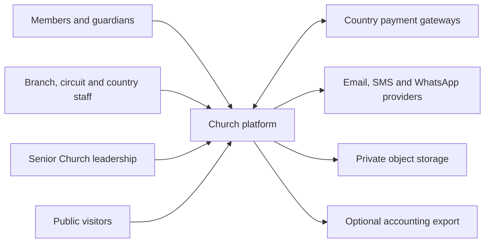
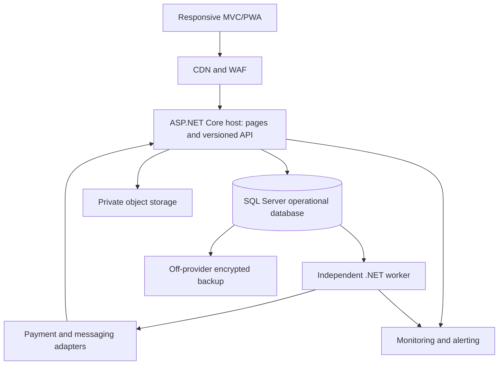

# Context and container architecture

Status: Draft. Owner: Solution architect. This is an implementation view of the [target blueprint](church-management-platform-blueprint.md), not a description of the current deployed application.

## Context

## Initial containers

One deployable web/API host contains strongly separated modules. A separate worker consumes a SQL transactional outbox. Payment providers call signed webhook endpoints; a browser return page never posts a contribution by itself. The public site and privileged administration share a host initially but have separate authorization policies, rate limits and data projections.

## Boundaries and failure behavior

- Web requests commit their own database work and outbox message; external message delivery is asynchronous.
- Provider outage creates a visible retry/dead-letter state, not a lost transaction.
- Object storage holds binary files; SQL holds ownership and access metadata.
- Offline branch devices submit idempotent operations on reconnect; the server is authoritative.
- Country split, read replicas, Redis and managed queue are future options justified by measured load or legal need, not prerequisites.

Deployment details and unresolved hosting choices are in the [NFR](non-functional-requirements.md), [hosting ADR](../adr/0004-hosting-and-workers.md), and [deployment runbook](../operations/deployment-runbook.md).
